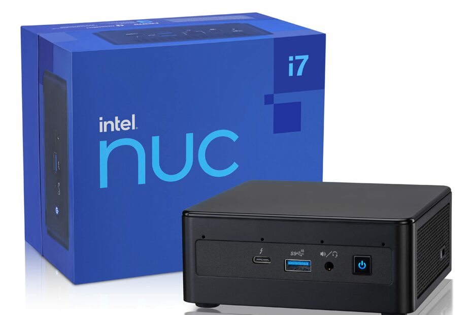

# **💥 Hardware Configuration**

## **📸 Imaging**

* I have garnered substantial expertise in working with diverse imaging devices, specializing in the calibration and utilization of various cameras and 3D sensors.

    ??? success "Devices"

        === "Creative DepthSense 325 3D Camera" 
            <figure markdown>
            { width="500" }
            <figcaption>Image Credits: [TechLeer](https://www.techleer.com/articles/176-softkinetic-to-announce-depthsense-time-of-flight-technology-at-mobile-world-congress/)</figcaption>
            </figure>
            
            

        === " Microsoft Kinect " 
            
            <figure markdown>
            { width="500" }
            <figcaption>Image Credits: [The Technophile](https://chinmaychinara.wordpress.com/2014/12/11/microsoft-kinect-for-windows-sdk-v1-8-a-paramount-leap-towards-3-d-imaging/)</figcaption>
            </figure>

        === "Structure Sensor"
            
            <figure markdown>
            { width="500" }
            <figcaption>Image Credits: [TechCrunch](https://techcrunch.com/2013/09/17/occipitals-new-structure-sensor-turns-your-ipad-into-a-mobile-3d-scanner/)</figcaption>
            </figure>
                    

        === "Bumblebee Stereo"
            
            <figure markdown>
            { width="500" }
            <figcaption>Image Credits: [Teledyne Flir](https://www.flir.com/support/products/bumblebee2-firewire/#Overview)</figcaption>
            </figure>

        === "Minoru 3D"
            
            <figure markdown>
            { width="500" }
            <figcaption>Image Credits: [Pocket-lint](https://www.pocket-lint.com/laptops/reviews/70839-novo-minoru-3d-webcam-review)</figcaption>
            </figure>

        === "Custom Stereo Setup"
            
            <figure markdown>
            { width="500" }
            <figcaption>Representative image. Credits: [Stackable](https://erget.wordpress.com/2014/02/01/calibrating-a-stereo-camera-with-opencv/)</figcaption>
            </figure>

        
        === "Fisheye Camera"
            
            <figure markdown>
            { width="500" }
            <figcaption>Image Credits: [Ardu Cam](https://www.arducam.com/product/u0858-1-4-m12-mount-1-05mm-focal-length-fisheye-camera-lens-ls-40180-for-raspberry-pi/)</figcaption>
            </figure>

        
        === "Monochrome Camera"
            
            <figure markdown>
            { width="300" }
            <figcaption>Image Credits: [Edmund Optics](https://www.edmundoptics.com/p/bfs-u3-04s2m-cs-usb3-blackflyreg-s-monochrome-camera/40161/)</figcaption>
            </figure>
        
        === "Velodyne Lidar"
            
            <figure markdown>
            { width="300" }
            <figcaption>Image Credits: [Velodyne Lidar](https://velodynelidar.com/products/puck/)</figcaption>
            </figure>   

    My hands-on experience with these imaging devices has equipped me with the necessary skills to perform calibration and utilize them effectively for various applications, contributing to cutting-edge projects in imaging and 3D sensing domains.

## **🖥️ Computing**

*  I have proficiently worked with various computing boards and mini-PCs, enabling me to build efficient and powerful hardware configurations.

    ??? success "Devices"

        === "NVIDIA Jetson Xavier NX" 
            <figure markdown>
            { width="500" }
            <figcaption>Image Credits: [Ubuy India](https://www.ubuy.co.in/product/2JCRYRU-nvidia-jetson-xavier-nx-developer-kit-812674024318)</figcaption>
            </figure>

        === "Raspberry Pi" 
            <figure markdown>
            { width="500" }
            <figcaption>Image Credits: [Ubuy India](https://www.ubuy.co.in/product/2JCRYRU-nvidia-jetson-xavier-nx-developer-kit-812674024318)</figcaption>
            </figure>

        === "Intel Neural Compute Stick 2" 
            <figure markdown>
            { width="500" }
            <figcaption>Image Credits: [Robu.in](https://robu.in/product/intel-movidius-neural-compute-stick-2/)</figcaption>
            </figure>

        === "ODROID" 
            <figure markdown>
            { width="500" }
            <figcaption>Image Credits: [makezine.com](https://makezine.com/products/boards/odroid-xu4/)</figcaption>
            </figure>

        === "Beagleboard" 
            <figure markdown>
            { width="500" }
            <figcaption>Image Credits: [RS-Online](https://www.rs-online.id/p/beagleboard-org-beaglebone-black-mcu-development-board-beaglebone-black/)</figcaption>
            </figure>
            

        === "Intel NUC mini-PC" 
            <figure markdown>
            { width="500" }
            <figcaption>Image Credits: [GetPCAPP](https://getpcapp.com/wifi-warden-pc-windows-mac-free-download/)</figcaption>
            </figure>
            