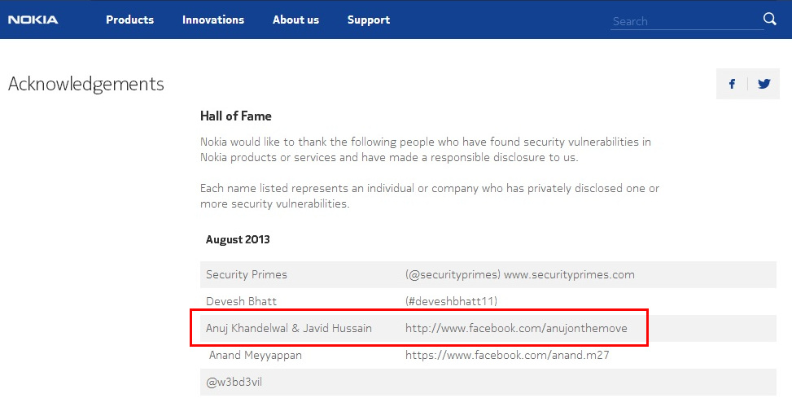

# **🚀 Software Engineering**

### **✅ Software Engineering Best Practices**

I have co-developed a comprehensive [**Python Machine Learning Template**](https://github.com/anujonthemove/Python-Machine-Learning-Template) which encapsulates industry best practices, streamlining the development process and promoting code reusability for Pyhon projects.  

### **✅ Containerization**
I have an advanced understanding of Dockers, leveraging the power of containerization to simplify application deployment and management. I understand how to utilize Docker to enable seamless packaging of applications and their dependencies for scalability and consistency across different environments.

### **✅ Linux**

With over 10+ years of working experience on Linux, I am well-versed in this powerful and versatile operating system. My proficiency in Linux encompasses:

1. **Shell Scripting:** I excel in creating efficient and automated shell scripts, optimizing various processes and tasks.

2. **Linux Setup and Configuration:** I have extensive experience in setting up Linux on a diverse range of platforms, including laptops, desktops, miniature computing boards, and bare metal servers. Having performed 💯+ installations, I am adept at customizing Linux installations to suit specific requirements.

### **✅ Web Development - Back-End Engineering**

During my college years in 2014, I started learning web development with a focus on back-end engineering. I worked on various projects that demonstrated helped me gain an in-depth knowledge of designing efficient back-end solutions. I took on freelance work and successfully delivered more than 10 websites for clients. Notably, I contributed as a back-end engineer to the following projects:

1. [**FollowMe247 (College Start-Up):**](https://www.youtube.com/watch?v=n4YmCYKtp2I&ab_channel=AnujKhandelwal) Played a key role in developing the back-end infrastructure for this college start-up, facilitating its growth and functionality.

2. **Online Lab (Computer Based Tests - CBT):** Created an offline web application specifically designed for conducting Computer-Based Tests in schools, catering to the needs of my alma mater.

    ??? danger "Appreciation"
        {width=800px}

3. **MedEx (Medicine Status/Delivery Tracking):** Collaborated with a client based in Brazil to build an internal web portal that efficiently tracked medicine status and delivery.

4. **epiphany.in (College Event):** Developed the web platform for a college event, ensuring seamless user experience and efficient event management.

5. [**hacktrack.in (Hacking Competitions):**](https://www.facebook.com/events/netaji-subhas-institute-of-technology/hacktrack-a-workshop-on-ethical-hacking-and-information-security-by-mrsunny-vagh/558818067475333/) Crafted a dynamic web portal for [**TechDefenceLabs**](https://techdefencelabs.com/), dedicated to hosting and managing hacking competitions.

    **Tech Stack:**

    In these endeavors, I extensively worked with the following technologies and frameworks:

    1. PHP + MySQL Stack
    2. CodeIgniter - Model-View-Controller (MVC) PHP framework
    3. Twitter Bootstrap - Front-End Framework
    4. HTML, JavaScript, CSS, and jQuery

    I gained valuable experience in utilizing Content Management Systems (CMS) like WordPress, Drupal, and Joomla to streamline website management and content publication.

### **✅ Web Development - Front-End**

In parallel with back-end engineering, I explored the realm of front-end web development. I learned to design web templates from scratch using HTML, CSS, and JavaScript, which allowed me to understand front-end development very well. I also learned to utilized [**Twitter Bootstrap**](https://getbootstrap.com/2.0.2/), a powerful front-end framework, to create responsive and visually appealing web designs.

### **✅ Information Security**
When developing web applications, I realized the critical importance of secure coding practices to protect against potential attacks. This led me to delve into various aspects of this domain:

* **Penetration Testing and Vulnerability Assessment**

* **Reverse Engineering** 

* **Social Engineering and Bug Bounty**

    ??? danger "Nokia Hall of Fame for 2013"
        
        {width=1000px}

**Tools Explored:**

Throughout my exploration in information security, I gained expertise in several essential tools and concepts, including:

* Kali Linux
* Wireshark

**Security Concepts Learnt:**

* DDoS Mitigation
* Basics of Networking
* OWASP (Open Web Application Security Project)
* Cross-Site Scripting (XSS)
* SQL Injection
